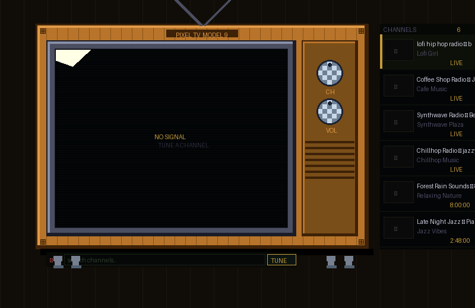

# 📺 Pixel TV

> A retro pixel-art CRT television that lives in your VS Code Explorer sidebar — tune in to YouTube without leaving your editor.



---

## Installation

Install from the [VS Code Marketplace](https://marketplace.visualstudio.com/items?itemName=lucilehan.pixel-tv) or search **"Pixel TV"** in the Extensions sidebar.

Or install manually from a `.vsix`:

```bash
code --install-extension pixel-tv-1.0.1.vsix
```

---

## Usage

Pixel TV lives in the **Explorer sidebar** underneath Timeline. Open the Explorer panel (`Cmd+Shift+E`) and scroll down to find it — or focus it directly with:

| Platform | Shortcut |
|----------|----------|
| macOS    | `Cmd+Shift+Y` |
| Windows / Linux | `Ctrl+Shift+Y` |

---

## Features

### 📺 Lives in the Explorer Sidebar
Pixel TV sits permanently in the Explorer pane underneath Timeline — always accessible, never in the way. The screen fills the available width and scales with the panel.

### 🎛️ Retro Pixel-Art TV Shell
A handcrafted CRT television with wood-grain cabinet, thick plastic bezel, corner screws, checkered channel knobs, speaker grille, and LED indicator dots. Everything is pure CSS.

### 🔍 Built-in Search
Type anything into the search bar and hit **TUNE** — the TV scans its channel library and surfaces the best matches with a satisfying loading animation.

### ⚡ Quick-Access Genre Chips
One-click chips to instantly tune into your favourite category:

| Chip | Genre |
|------|-------|
| ◎ LOFI | Lo-fi hip hop & chill beats |
| ▶ SYNTH | Synthwave & retrowave |
| ♪ JAZZ | Jazz, bossa nova & coffee shop |
| ~ NATURE | Rain, ocean waves & forest ambience |
| ⚡ GAMING | Epic gaming & EDM mixes |
| ✦ FOCUS | Deep focus, binaural beats & classical |

### 📡 Channel List
The results panel shows available channels at all times — browse and switch without interrupting your flow.

### 🎚️ Draggable Knobs
Spin the **CH** and **VOL** dials with your mouse. The CH dial animates every time you switch channels.

### 📺 In-Editor Playback
Videos embed directly using `youtube-nocookie.com` — no ads, no tracking, no leaving the editor.

---

## Building from Source

```bash
git clone https://github.com/lucilehan/pixel-tv.git
cd pixel-tv
npm install
npm run compile
```

Press `F5` in VS Code to launch in debug mode.

To package:

```bash
npm install -g @vscode/vsce
vsce package
```

---

## Contributing

Issues and pull requests are welcome! If you have a channel you'd love to see in the default library, open an issue with the YouTube video ID and genre.

---

## Changelog

### 1.0.1
- Moved from editor tab to **Explorer sidebar** (underneath Timeline) using `WebviewViewProvider`
- Redesigned layout for narrow column — screen fills full width with 16:9 aspect ratio
- Knob strip moved to bottom of sidebar panel
- Keyboard shortcut now focuses the Explorer sidebar view directly
- Version bump and README fix for missing screenshot

### 1.0.0
- Initial release
- Pixel-art CRT TV shell with wood-grain cabinet, bezel, knobs, and legs
- 23 built-in channels across 6 genres
- Search with scoring algorithm
- Quick-access genre chips
- Draggable CH and VOL knobs
- In-editor YouTube playback via `youtube-nocookie.com`

---

*Made with 📺 by [lucile han](https://github.com/lucilehan)*
